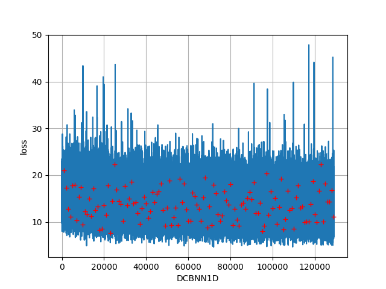
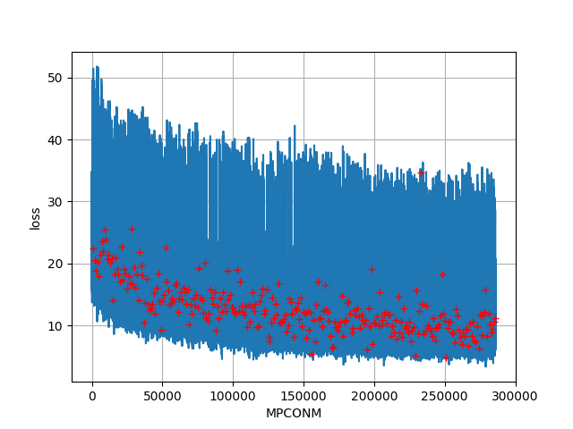

本文件为该目录（./acoustic）下模型的具体介绍

# ABCDNN
A(Attention) B(Batchnorm) C(Conv) D(Deep) NN(nerual network), hhhhh...
## DCNN2D
参考ASRT项目迁移过来的模型，确实有一定效果，在初期帮助我理解CTC解码提供了很大的帮助，但遗憾的是效果确实有限，loss大概能到25。

## DCBNN2D
参考ASRT项目复制过来的模型，包括BatchNorm，同样效果有限，thchs30数据集大概loss只能降到25

## DCBNN1D
将DCBNN2D中的结构不扩维，直接在1D上进行操作，效果出奇的好，清华数据集能够过拟合，loss可以降到3左右（过拟合了），在多数据集上loss大概能降到13左右，此时准确率大概会有80%左右。

因为这个模型，我把在清华数据集上的效果作为baseline来测试我的其他模型（连清华数据集都过拟合不了，更谈不上泛化了）

在将其余用到的数据集全部丢进去后，仍然能有较好的训练结果，但没有办法完全拟合，大概loss会降到13左右，此时得到了release中提供的`DCBNN1D_cur_best.h5`

## DCBNN1Dplus
在DCBNN1D的基础上叠加卷积层，目前训练结果来看效果没有DCBNN1D好，可能训练次数不够，欠拟合；也可能层数过多，优化器能力不足。图没有及时留证，这里不提供了。

> 考虑添加残差结构

## DCBANN1D
在DCBNN1D的基础上添加了Attention结构，仍然有一定的效果，但效果比DCBNN1D反而变差了，暂时没有深究原因，可能是因为需要对齐的都聚集在时间步附近，而Attention是在全局范围内寻找对齐要素

# LASModel
《Listen,Attend and Spell》的论文实现（不完全版），总之这个文件下的所有模型暂时以失败告终

具体的原因，可能是因为模型效果很差，可能是因为训练时长不够，或者其他原因，总之暂时这个结构不打算尝试了，感兴趣的朋友可以再验证一下。
## LASModel[已废弃]
两层pBiLSTM+DCBNN1D的卷积，小数据集上能拟合，大数据集上没有办法拟合。

## ReLAS[已废弃]
DCBNN1D的卷积+两层pBiLSTM，和LASModel一样的差

## LASCTCModel[已废弃]
在LASModel的基础上添加了ctc结构（原论文里特意强调不需要用ctc也得到了很好的结果）

# MAXM
是Somiao输入法的声学模型迁移版

## MCONM[已废弃]
基本完全参考了somiao的结构，进行了训练，但效果不好，loss只能降到55左右，准确率也差不多是55

## MPCONM
在MCONM的基础上将parent结构替换为三层卷积+池化（DCBNN1D的结构），效果开始明显，主要表现在初期loss下降极快。大概batchsize=16，step=1000，epoch=8的时候loss就降到了25左右。

但在大概降到25左右的时候开始急剧变缓，epoch=200时loss才降到11，准确率约有75%

epoch=300时候loss仍然是11，但准确率发现开始上升，在原数据集上基本能够拟合，在测试集上能达到70-80%左右的正确率。

> 截至2019年7月15日23:44:18第二好的模型，可以考虑挖掘一下其潜力。

> loss下降极快应该与MPCONM的残差结构有关，这一点在MCONM上也有体现，但最后的性能极限可能是残差连接无法提升的，尝试其他结构。

> 如，将一层残差连接替换为多层残差连接？ [TODO]

# WAVE
《WaveNet: A Generative Model for Raw Audio》的实现尝试
## WAVEM
wavenet的迁移版，参考了网上一个TensorFlow的开源实现，链接在参考链接中提供了。

2019年7月14日14:43:36，loss降到196，但是准确率为0，ctc解码后无汉字，继续训练，loss降到80左右时开始有准确率，而且稳步上升，因为某些原因暂时没有继续训练。
