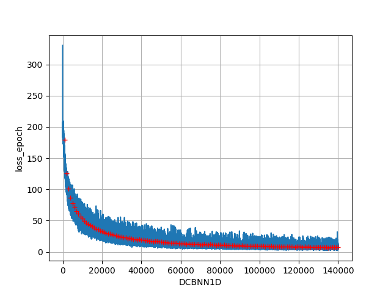
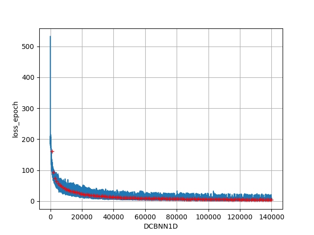
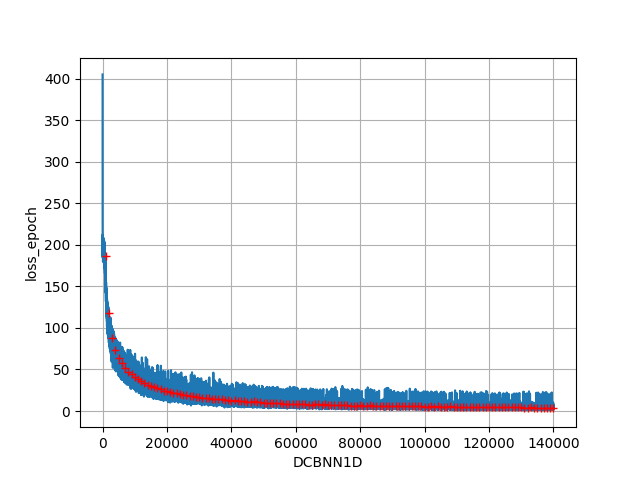
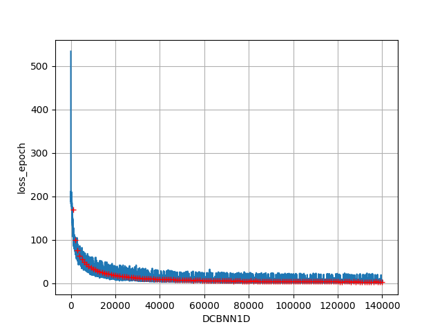

关于目前实现的几种特征提取方法的对比

对比方式：使用thchs30数据集训练DCBNN1D，在batch_size=16,step=1000,epoch=140时候（一般基本能拟合），比对训练时长和loss值，并绘制最终的loss下降曲线

# MelFeature

# MelFeature2
loss下降到10左右，对训练集的正确率大约有50%，效果比较差。速度较快

# MelFeature3
loss下降到4.5左右，对训练集的正确率大约有65%左右，提取速度较慢

# MelFeature4
loss下降到4左右， 对训练集的正确率大约有80%左右，提取速度一般

# MelFeature5
loss下降到3左右，对训练集的正确率大约有80%以上，提取速度较慢。
